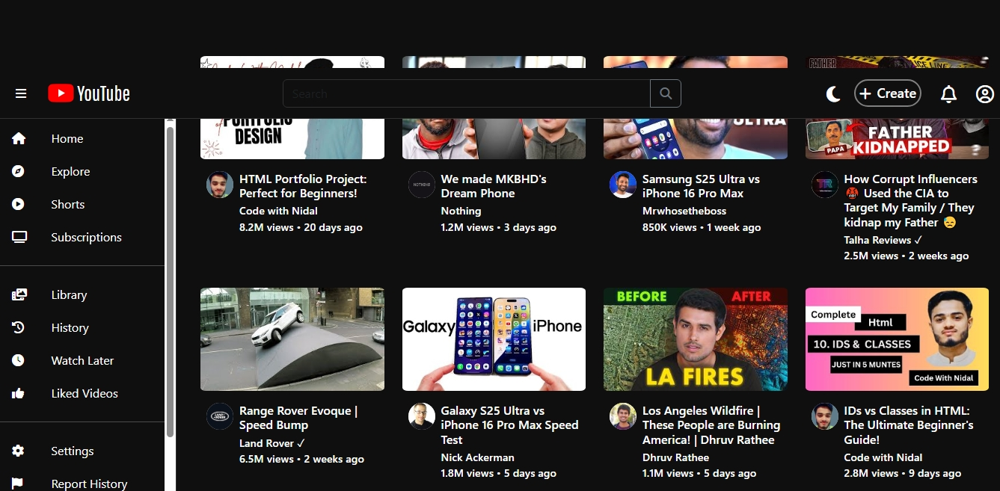

# 🎥 YouTube Clone

A fully functional **YouTube Clone** built using **React**, **Material UI**, **RapidAPI**, and **Axios**. This project replicates the core functionality and layout of YouTube, allowing users to search for videos, watch content, and explore channels—all in a modern, responsive UI.



---

## 🚀 Features

- 🔍 **Search Functionality** - Search and fetch videos using YouTube Data API.
- 📺 **Video Playback** - Watch videos within a dedicated player.
- 🧭 **Channel Pages** - View channel details and related videos.
- 🧩 **Related Videos** - Suggestions for similar content.
- 🎨 **Material UI Design** - Sleek and fully responsive user interface.
- ⚡ **RapidAPI Integration** - High-speed API access for video data.

---

## 🛠️ Tech Stack

- **Frontend:** React, JavaScript, Material UI
- **API:** RapidAPI (YouTube v3)
- **Networking:** Axios
- **Routing:** React Router DOM

---

## 📁 Project Structure

```bash
youtube_clone/
│
├── public/
│   └── index.html
│
├── src/
│   ├── assets/             # Static files (e.g., screenshot)
│   ├── components/         # Reusable UI components
│   ├── pages/              # Main application pages
│   ├── utils/              # Utility files (e.g., API config)
│   ├── App.js              # Root component
│   └── index.js            # React DOM rendering
│
├── .gitignore
├── package.json
├── README.md
└── vite.config.js
📦 Installation
Clone the repository

bash
Copy
Edit
git clone https://github.com/DoctorJunaid/youtube_clone.git
cd youtube_clone
Install dependencies

bash
Copy
Edit
npm install
Set up your RapidAPI key

Go to RapidAPI YouTube v3 and subscribe.

Create a .env file and add your API key:

ini
Copy
Edit
VITE_RAPIDAPI_KEY=your_rapidapi_key_here
Start the development server

bash
Copy
Edit
npm run dev
📸 Demo
You can view a live preview of the app in the screenshot above or deploy it to platforms like Vercel or Netlify for a live demo.

💡 Upcoming Features
✅ Video comments section

✅ Like/Dislike system

✅ Dark mode toggle

✅ Infinite scroll on home feed

🤝 Contributing
Contributions are welcome! If you have suggestions or improvements, feel free to:

Fork the project

Create a new branch

Commit your changes

Open a pull request

📜 License
This project is licensed under the MIT License.

📬 Contact
Author: Dr. Junaid
GitHub: @DoctorJunaid
