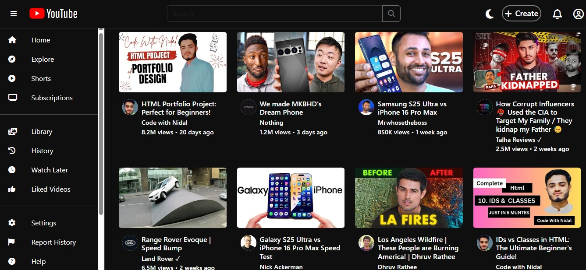

# 🎥 YouTube Clone

A fully responsive **YouTube Clone** built with **HTML**, **CSS**, **JavaScript**, and **Bootstrap**. This project replicates YouTube's core design and user interface with modern web technologies, featuring a clean, responsive layout that works seamlessly across all devices.



---

## ✨ Features

- 🎨 **Pixel-Perfect YouTube UI** - Accurate recreation of YouTube's interface
- 📱 **Fully Responsive Design** - Optimized for desktop, tablet, and mobile devices
- 🌙 **Dark/Light Mode Toggle** - Switch between themes with persistent storage
- 🔍 **Interactive Search Bar** - Desktop and mobile-optimized search functionality
- 📺 **Video Grid Layout** - Dynamic video card layout with hover effects
- 🧭 **Collapsible Sidebar** - Space-efficient navigation with toggle functionality
- 🎯 **Video Thumbnails** - Real video thumbnails with channel information
- 📊 **View Count & Upload Time** - Realistic video metadata display
- 🔗 **External Video Links** - Direct links to actual YouTube videos
- ⚡ **Smooth Animations** - CSS transitions and hover effects
- 🔐 **Sign-in Page** - Dedicated authentication interface

---

## 🛠️ Tech Stack

- **Frontend:** HTML5, CSS3, JavaScript (ES6+)
- **Framework:** Bootstrap 5.3.2
- **Icons:** Font Awesome 6.4.2
- **Fonts:** Google Fonts (Pathway Gothic One)
- **Storage:** localStorage for theme persistence

---

## 📁 Project Structure

```
youtube_clone/
│
├── assets/                 # Static assets
│   ├── logo.svg           # YouTube logo
│   ├── thumbnail*.jpg     # Video thumbnails
│   ├── channel*.jpg       # Channel avatars
│   └── screenshot1.jpeg   # App screenshot
│
├── index.html             # Main homepage
├── sign-in.html          # Authentication page
├── style.css             # Main stylesheet
├── script.js             # JavaScript functionality
└── README.md             # Project documentation
```

---

## 🚀 Getting Started

### Prerequisites
- A modern web browser (Chrome, Firefox, Safari, Edge)
- Basic understanding of HTML/CSS/JavaScript (for modifications)

### Installation

1. **Clone the repository**
   ```bash
   git clone https://github.com/DoctorJunaid/youtube_clone.git
   cd youtube_clone
   ```

2. **Open the project**
   ```bash
   # Simply open index.html in your browser
   open index.html
   # OR double-click the index.html file
   ```

3. **Start developing**
   - No build process required
   - Make changes and refresh your browser
   - All assets are locally hosted

---

## 🎯 Key Features Breakdown

### 🌙 Theme System
- **Automatic theme persistence** using localStorage
- **CSS custom properties** for easy theme switching
- **Smooth transitions** between light and dark modes

### 📱 Responsive Design
- **Mobile-first approach** with progressive enhancement
- **Collapsible sidebar** that adapts to screen size
- **Touch-friendly interface** for mobile devices
- **Optimized search bar** for different screen sizes

### 🎨 UI Components
- **Video cards** with hover effects and animations
- **Channel avatars** with proper styling
- **Navigation sidebar** with YouTube-like structure
- **Header navigation** with all essential controls

### 🔍 Search Functionality
- **Desktop search bar** with full-width input
- **Mobile search** with slide-out animation
- **Search icon toggle** for mobile devices
- **Keyboard navigation** support

---

## 📸 Screenshots

### Desktop View
- Full sidebar navigation
- Multi-column video grid
- Complete header with search

### Mobile View  
- Collapsible sidebar overlay
- Single-column video layout
- Mobile-optimized search

### Dark Mode
- Complete dark theme
- Consistent color scheme
- Preserved functionality

---

## 🎨 Customization


## 🤝 Contributing

Contributions are welcome! Here's how you can help:

1. **Fork the project**
2. **Create a feature branch** (`git checkout -b feature/amazing-feature`)
3. **Commit your changes** (`git commit -m 'Add amazing feature'`)
4. **Push to the branch** (`git push origin feature/amazing-feature`)
5. **Open a Pull Request**

### Contribution Guidelines
- Follow existing code style and structure
- Test on multiple browsers and devices
- Update documentation as needed
- Add screenshots for UI changes

---

## 📋 Known Issues

- External video links redirect to actual YouTube
- No video playback functionality (by design)
- Search functionality is visual only
- Sign-in redirects to Google accounts

---

## 📜 License

This project is licensed under the **MIT License** - see the [LICENSE](LICENSE) file for details.

---

## 👨‍💻 Author

**Dr. Junaid**
- GitHub: [@DoctorJunaid](https://github.com/DoctorJunaid)


## 🙏 Acknowledgments

- **YouTube** for the original design inspiration
- **Bootstrap** for the responsive framework
- **Font Awesome** for the beautiful icons
- **Google Fonts** for typography
- **The web development community** for tutorials and inspiration

---

## 📊 Project Stats

- **Languages:** HTML, CSS, JavaScript
- **Framework:** Bootstrap 5
- **Total Files:** 5 main files
- **Responsive:** ✅ Mobile-first design
- **Browser Support:** ✅ Modern browsers
- **Theme Support:** ✅ Dark/Light modes

---

⭐ **Star this repository** if you found it helpful!
